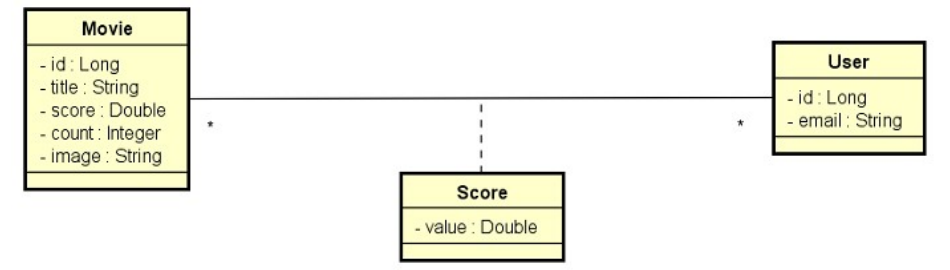

# **Desafio 04 - Curso Java Spring Expert: Módulo 05**

## DSMovie

### Sobre o projeto
Este é um projeto de filmes e avaliações de filmes. A visualização dos dados dos filmes é
pública (não necessita login), porém as alterações de filmes (inserir, atualizar, deletar) são
permitidas apenas para usuários ADMIN. As avaliações de filmes podem ser registradas por
qualquer usuário logado CLIENT ou ADMIN. A entidade Score armazena uma nota de 0 a 5
(score) que cada usuário deu a cada filme. Sempre que um usuário registra uma nota, o
sistema calcula a média das notas de todos usuários, e armazena essa nota média (score) na
entidade Movie, juntamente com a contagem de votos (count).

### Modelo de Domínio

### Enunciado
Deverá implementar os testes unitários Rest Assured comforme está no projeto.
  
### Critérios de Correção

- GET /movies deve retornar 200 quando não forem informados argumentos
- GET /movies deve retornar 200 com página de filmes quando um título for informado
- GET /movies/{id} deve retornar 200 com um filme quando o id existir
- GET /movies/{id} deve retornar 404 quando id não existir
- POST /movies deve retornar 422 quando informado nome em branco
- POST /movies deve retornar 403 quando CLIENT logado
- POST /movies deve retornar 401 quando token for inválido
- PUT /scores deve retornar 404 quando id do filme não existir
- PUT /scores deve retornar 422 quando id do filme não for informado
- PUT /scores deve retornar 422 quando valor do score for menor que zero

### Competências avaliadas:
- Testes de API com RestAssured e Spring Boot
